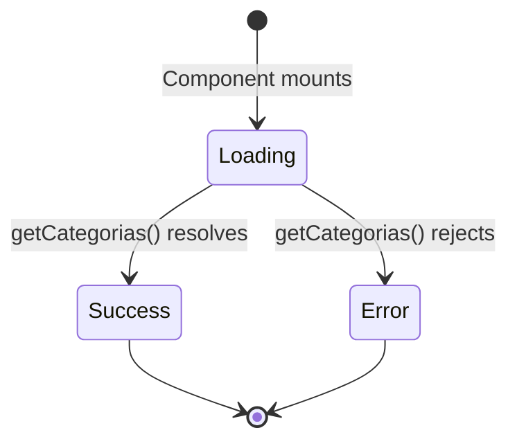

## Overview

This guide demonstrates how Q-Sopa components use the API service functions in production. All examples are taken directly from the application source code.

## Loading Categories

The `Categories` component fetches all menu categories on mount and displays them in the navigation.

### Complete Implementation

```jsx src/components/Categories/Categories.jsx
import { useState, useEffect } from "react";
import { getCategorias } from "../../services/api";

export default function Categories({ onCategoryChange }) {
  const [active, setActive] = useState(null);
  const [categories, setCategories] = useState([]);
  const [loading, setLoading] = useState(true);
  const [error, setError] = useState(null);

  useEffect(() => {
    getCategorias()
      .then((data) => {
        setCategories(data);
      })
      .catch((err) => setError(err.message))
      .finally(() => setLoading(false));
  }, []);

  const handleClick = (id) => {
    setActive(id);
    onCategoryChange?.(id);
  };

  if (loading) return <p className="categories-status">Cargando...</p>;
  if (error)   return <p className="categories-status error">{error}</p>;

  return (
    <div className="categories-container">
      {categories.map((cat) => (
        <button
          key={cat.id}
          className={`category-btn ${active === cat.id ? "active" : ""}`}
          onClick={() => handleClick(cat.id)}
        >
          <span className="material-symbols-outlined">{cat.icon}</span>
          <span className="category-label">{cat.name}</span>
        </button>
      ))}
    </div>
  );
}
```

### Key Patterns

<CardGroup cols={2}>
  <Card title="State Management" icon="database">
    Uses three separate state variables for data, loading, and errors
  </Card>
  <Card title="Promise Chain" icon="link">
    Uses `.then()/.catch()/.finally()` for async flow control
  </Card>
  <Card title="Loading States" icon="spinner">
    Shows loading message while fetching data
  </Card>
  <Card title="Error Display" icon="exclamation">
    Renders error message if request fails
  </Card>
</CardGroup>

### State Transitions



<Note>
  The component uses the nullish coalescing operator (`?.`) when calling `onCategoryChange` to safely handle cases where the callback might be undefined.
</Note>

---

## Loading Products by Category

The `Menu` component fetches products when a user selects a category from the navigation.

### Complete Implementation

```jsx src/pages/Menu.jsx
import { useState, useEffect } from "react";
import ProductCard from "../components/ProductCard/ProductCard";
import { getProductsByCategory } from "../services/api";

export default function Menu() {
  const [products, setProducts] = useState([]);
  const [loading, setLoading] = useState(false);
  const [error, setError] = useState(null);
  const [activeCategoryId, setActiveCategoryId] = useState(null);

  const handleCategoryChange = (categoryId) => {
    setActiveCategoryId(categoryId);
  };

  const handleLogoClick = () => {
    setActiveCategoryId(null);
    setProducts([]);
  };

  useEffect(() => {
    // Don't fetch if no category selected
    if (activeCategoryId === null) return;

    setLoading(true);
    setError(null);

    getProductsByCategory(activeCategoryId)
      .then((data) => setProducts(data))
      .catch((err) => setError(err.message))
      .finally(() => setLoading(false));
  }, [activeCategoryId]);

  return (
    <main className="menu-container">
      {/* No category selected */}
      {activeCategoryId === null && (
        <div className="splash">Select a category to view products</div>
      )}

      {/* Loading state */}
      {activeCategoryId !== null && loading && (
        <div className="menu-loading">
          <span className="menu-spinner" />
          <p>Cargando productos...</p>
        </div>
      )}

      {/* Error state */}
      {activeCategoryId !== null && !loading && error && (
        <p className="menu-error">⚠️ {error}</p>
      )}

      {/* Empty state */}
      {activeCategoryId !== null && !loading && !error && products.length === 0 && (
        <p className="menu-empty">No hay productos en esta categoría.</p>
      )}

      {/* Success state - render products */}
      {activeCategoryId !== null && !loading && !error && products.length > 0 && (
        <section className="products-grid">
          {products.map((product) => (
            <ProductCard
              key={product.id}
              title={product.name}
              price={product.price}
              image={product.imageUrl}
              badge={product.badge ?? null}
            />
          ))}
        </section>
      )}
    </main>
  );
}
```

### Advanced Patterns

#### Conditional Effect Execution

The effect only runs when a category is selected:

```javascript
useEffect(() => {
  if (activeCategoryId === null) return;
  // ... fetch products
}, [activeCategoryId]);
```

<Note>
  Using early return prevents unnecessary API calls when no category is selected.
</Note>

#### State Reset on Category Change

The effect clears errors before each new fetch:

```javascript
setLoading(true);
setError(null); // Clear previous errors

getProductsByCategory(activeCategoryId)
  .then((data) => setProducts(data))
  .catch((err) => setError(err.message))
  .finally(() => setLoading(false));
```

#### Comprehensive UI States

The component handles five distinct states:

<CardGroup cols={2}>
  <Card title="Initial" icon="circle">
    No category selected - show splash screen
  </Card>
  <Card title="Loading" icon="spinner">
    Category selected, fetching data - show spinner
  </Card>
  <Card title="Error" icon="exclamation">
    Request failed - show error message
  </Card>
  <Card title="Empty" icon="inbox">
    No products in category - show empty state
  </Card>
  <Card title="Success" icon="check">
    Products loaded - render product grid
  </Card>
</CardGroup>

---

## Complete Data Flow

Here's how data flows through the application:

### 1. Initial Load

```jsx
// App renders Navbar
<Navbar onCategoryChange={handleCategoryChange} />

// Navbar renders Categories
<Categories onCategoryChange={onCategoryChange} />

// Categories fetches on mount
useEffect(() => {
  getCategorias()
    .then(setCategories)
    .catch(setError)
    .finally(() => setLoading(false));
}, []);
```

### 2. User Interaction

```jsx
// User clicks category button
<button onClick={() => handleClick(cat.id)}>
  {cat.name}
</button>

// Categories component calls parent callback
const handleClick = (id) => {
  setActive(id);
  onCategoryChange?.(id); // Propagates to Menu
};
```

### 3. Product Fetch

```jsx
// Menu receives category ID
const handleCategoryChange = (categoryId) => {
  setActiveCategoryId(categoryId);
};

// Effect triggers API call
useEffect(() => {
  if (activeCategoryId === null) return;
  
  setLoading(true);
  getProductsByCategory(activeCategoryId)
    .then(setProducts)
    .catch(setError)
    .finally(() => setLoading(false));
}, [activeCategoryId]);
```

### 4. Render Products

```jsx
{products.map((product) => (
  <ProductCard
    key={product.id}
    title={product.name}
    price={product.price}
    image={product.imageUrl}
    badge={product.badge ?? null}
  />
))}
```

---

## Error Handling Strategies

### Display User-Friendly Messages

```jsx
{error && (
  <div className="error-banner">
    <span className="error-icon">⚠️</span>
    <p>{error}</p>
  </div>
)}
```

### Implement Retry Functionality

```jsx
function ProductList() {
  const [error, setError] = useState(null);
  const [retryCount, setRetryCount] = useState(0);

  const fetchProducts = () => {
    setError(null);
    getProductsByCategory(categoryId)
      .then(setProducts)
      .catch((err) => setError(err.message));
  };

  useEffect(() => {
    fetchProducts();
  }, [retryCount]);

  return (
    <>
      {error && (
        <div className="error-container">
          <p>{error}</p>
          <button onClick={() => setRetryCount(c => c + 1)}>
            Reintentar
          </button>
        </div>
      )}
    </>
  );
}
```

### Log Errors for Debugging

```jsx
getCategorias()
  .then((data) => {
    setCategories(data);
    console.log('Categories loaded:', data.length);
  })
  .catch((err) => {
    setError(err.message);
    console.error('Failed to load categories:', err);
    // Optional: Send to error tracking service
    // trackError('getCategorias', err);
  })
  .finally(() => setLoading(false));
```

---

## Performance Optimizations

### Prevent Unnecessary Re-fetches

```jsx
const prevCategoryRef = useRef();

useEffect(() => {
  // Only fetch if category actually changed
  if (activeCategoryId === prevCategoryRef.current) return;
  
  prevCategoryRef.current = activeCategoryId;
  
  if (activeCategoryId === null) return;
  
  getProductsByCategory(activeCategoryId)
    .then(setProducts)
    .catch(setError);
}, [activeCategoryId]);
```

### Cache API Responses

```jsx
const cache = useRef({});

useEffect(() => {
  if (!activeCategoryId) return;

  // Return cached data immediately
  if (cache.current[activeCategoryId]) {
    setProducts(cache.current[activeCategoryId]);
    return;
  }

  setLoading(true);
  getProductsByCategory(activeCategoryId)
    .then((data) => {
      cache.current[activeCategoryId] = data;
      setProducts(data);
    })
    .catch(setError)
    .finally(() => setLoading(false));
}, [activeCategoryId]);
```

### Debounce Rapid Category Changes

```jsx
import { useEffect, useState } from 'react';
import { useDebounce } from './hooks/useDebounce';

function Menu() {
  const [selectedCategory, setSelectedCategory] = useState(null);
  const debouncedCategory = useDebounce(selectedCategory, 300);

  useEffect(() => {
    if (!debouncedCategory) return;
    
    getProductsByCategory(debouncedCategory)
      .then(setProducts)
      .catch(setError);
  }, [debouncedCategory]);
}
```

---

## Alternative: Async/Await Pattern

While Q-Sopa uses promise chains, you can also use async/await:

```jsx
useEffect(() => {
  const loadProducts = async () => {
    if (activeCategoryId === null) return;

    setLoading(true);
    setError(null);

    try {
      const data = await getProductsByCategory(activeCategoryId);
      setProducts(data);
    } catch (err) {
      setError(err.message);
    } finally {
      setLoading(false);
    }
  };

  loadProducts();
}, [activeCategoryId]);
```

<Note>
  The async/await pattern is more readable but requires wrapping in a separate function since `useEffect` callbacks cannot be async directly.
</Note>

---

## Testing API Integration

### Mock API Functions

```javascript __tests__/Menu.test.jsx
import { render, screen, waitFor } from '@testing-library/react';
import { vi } from 'vitest';
import Menu from '../pages/Menu';
import * as api from '../services/api';

vi.mock('../services/api');

test('displays products after loading', async () => {
  const mockProducts = [
    { id: 1, name: 'Burger', price: 10, imageUrl: 'url', badge: null }
  ];

  api.getProductsByCategory.mockResolvedValue(mockProducts);

  render(<Menu />);
  
  // Trigger category selection
  fireEvent.click(screen.getByText('Hamburguesas'));

  await waitFor(() => {
    expect(screen.getByText('Burger')).toBeInTheDocument();
  });
});

test('displays error message on failure', async () => {
  api.getProductsByCategory.mockRejectedValue(
    new Error('Error al cargar productos de la categoría')
  );

  render(<Menu />);
  
  fireEvent.click(screen.getByText('Hamburguesas'));

  await waitFor(() => {
    expect(screen.getByText(/Error al cargar/)).toBeInTheDocument();
  });
});
```

---

## Best Practices Summary

<CardGroup cols={2}>
  <Card title="Always Handle Loading" icon="spinner">
    Show loading indicators during API calls to improve UX
  </Card>
  <Card title="Display Errors" icon="exclamation">
    Show user-friendly error messages when requests fail
  </Card>
  <Card title="Handle Empty States" icon="inbox">
    Inform users when valid requests return no data
  </Card>
  <Card title="Reset State" icon="rotate">
    Clear errors and old data before new requests
  </Card>
  <Card title="Use Effect Cleanup" icon="broom">
    Cancel pending requests when components unmount
  </Card>
  <Card title="Implement Caching" icon="database">
    Avoid redundant API calls for the same data
  </Card>
</CardGroup>

## Common Pitfalls

<Warning>
  **Don't forget the dependency array**: Always include state variables used in `useEffect` in the dependency array to prevent stale closures.
</Warning>

<Warning>
  **Avoid race conditions**: When making sequential API calls based on user input, consider canceling previous requests or using the latest value only.
</Warning>

<Warning>
  **Handle component unmounting**: Set a cleanup function in `useEffect` to prevent setting state on unmounted components.
</Warning>

### Cleanup Example

```jsx
useEffect(() => {
  let isMounted = true;

  getProductsByCategory(activeCategoryId)
    .then((data) => {
      if (isMounted) setProducts(data);
    })
    .catch((err) => {
      if (isMounted) setError(err.message);
    });

  return () => {
    isMounted = false;
  };
}, [activeCategoryId]);
```

---

## Next Steps

<CardGroup cols={2}>
  <Card title="API Overview" icon="book" href="/api/overview">
    Review API architecture and design patterns
  </Card>
  <Card title="Endpoint Reference" icon="list" href="/api/endpoints">
    Explore detailed endpoint documentation
  </Card>
</CardGroup>