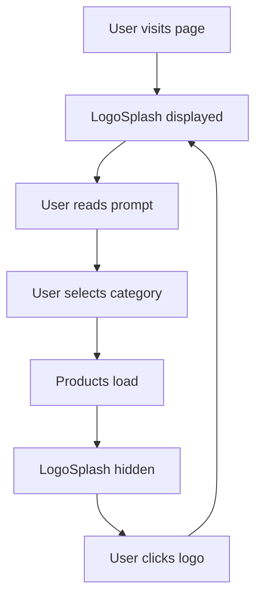

## Overview

The LogoSplash component creates an engaging welcome screen with an animated logo and ripple effects. It's displayed when no category has been selected, providing visual feedback and prompting users to choose a category.

## Location

```
src/components/LogoSplash/LogoSplash.jsx
src/components/LogoSplash/LogoSplash.css
```

## Props

This component does not accept any props. It's a purely presentational component.

## Source Code

```jsx src/components/LogoSplash/LogoSplash.jsx
import "./LogoSplash.css";
import logo from "../../assets/logo_Q-spoa.jpg";

export default function LogoSplash() {
  return (
    <div className="logo-splash">
      <div className="logo-ripple-wrapper">
        <div className="ripple ripple-1" />
        <div className="ripple ripple-2" />
        <div className="ripple ripple-3" />
        <div className="ripple ripple-4" />
        <div className="logo-circle">
          
        </div>
      </div>
      <p className="logo-splash-text">Selecciona una categoría para ver el menú</p>
    </div>
  );
}
```

## Purpose and Usage

The LogoSplash serves as the initial state of the menu page:

```jsx src/pages/Menu.jsx
export default function Menu() {
  const [activeCategoryId, setActiveCategoryId] = useState(null);
  
  return (
    <main className="menu-container">
      {/* Show LogoSplash when no category is selected */}
      {activeCategoryId === null && <LogoSplash />}
      
      {/* Show products when a category is selected */}
      {activeCategoryId !== null && (
        <section className="products-grid">
          {/* Product cards */}
        </section>
      )}
    </main>
  );
}
```

## When It's Displayed

The LogoSplash is conditionally rendered based on the application state:

<Tabs>
  <Tab title="Initial Load">
    When the user first visits the page and `activeCategoryId` is `null`, the LogoSplash is displayed.
    
    ```jsx
    const [activeCategoryId, setActiveCategoryId] = useState(null);
    // LogoSplash is visible
    ```
  </Tab>
  
  <Tab title="After Category Selection">
    When a user selects a category, `activeCategoryId` is set to the category ID, and LogoSplash is hidden.
    
    ```jsx
    setActiveCategoryId(3); // User selected category 3
    // LogoSplash is hidden, products are shown
    ```
  </Tab>
  
  <Tab title="Logo Click Reset">
    When the user clicks the navbar logo, the state resets to `null`, showing the LogoSplash again.
    
    ```jsx
    const handleLogoClick = () => {
      setActiveCategoryId(null);
      setProducts([]);
    };
    // LogoSplash is visible again
    ```
  </Tab>
</Tabs>

## Structure

### Main Container

```jsx
<div className="logo-splash">
```

The outer container centers the content vertically and horizontally on the page.

### Ripple Animation Wrapper

```jsx
<div className="logo-ripple-wrapper">
  <div className="ripple ripple-1" />
  <div className="ripple ripple-2" />
  <div className="ripple ripple-3" />
  <div className="ripple ripple-4" />
  <div className="logo-circle">
    
  </div>
</div>
```

Creates a visual effect with four concentric ripple animations surrounding the logo. Each ripple is a separate `<div>` with staggered animation timings defined in CSS.

### User Prompt Text

```jsx
<p className="logo-splash-text">Selecciona una categoría para ver el menú</p>
```

Displays instructional text prompting users to select a category.

## Animation Details

The component uses four ripple elements (`.ripple-1` through `.ripple-4`) that create a pulsating effect around the logo:

- Each ripple expands outward from the center
- Animations are staggered for a continuous wave effect
- CSS animations handle the timing and scaling
- The logo remains static at the center while ripples animate

<Note>
  The animation is entirely CSS-based, making it performant and not requiring any JavaScript animation libraries.
</Note>

## Styling Classes

- `.logo-splash` - Main container, centers content
- `.logo-ripple-wrapper` - Relative positioning container for ripples and logo
- `.ripple` - Base ripple animation styles
- `.ripple-1`, `.ripple-2`, `.ripple-3`, `.ripple-4` - Individual ripple timings
- `.logo-circle` - Circular container for the logo image
- `.logo-splash-img` - Styles for the logo image itself
- `.logo-splash-text` - Instructional text styling

## Assets

The component imports the restaurant logo:

```jsx
import logo from "../../assets/logo_Q-spoa.jpg";
```

The same logo used in the Navbar is displayed here with animation effects.

## Usage Example

```jsx
import LogoSplash from "./components/LogoSplash/LogoSplash";

function WelcomeScreen() {
  const [showMenu, setShowMenu] = useState(false);
  
  return (
    <>
      {!showMenu ? (
        <LogoSplash />
      ) : (
        <div className="menu">
          {/* Menu content */}
        </div>
      )}
    </>
  );
}
```

## User Experience Flow



The LogoSplash creates a clear visual state for "no selection made" and guides users toward their next action.

## Accessibility

The component includes proper alt text for the logo:

```jsx

```

This ensures screen readers can identify the logo image for visually impaired users.

## Responsive Behavior

The LogoSplash is designed to work across all screen sizes:

- Ripple animations scale proportionally
- Text remains readable on mobile devices
- Flexbox centering works on all viewports
- Logo size adjusts based on CSS media queries

<Warning>
  If animations cause performance issues on low-end devices, consider using the `prefers-reduced-motion` media query to disable animations for users who prefer reduced motion.
</Warning>

## Customization Ideas

<CardGroup cols={2}>
  <Card title="Dynamic Message" icon="message">
    Pass a custom message as a prop to change the instructional text.
  </Card>
  
  <Card title="Loading State" icon="spinner">
    Use a similar design for loading states throughout the app.
  </Card>
  
  <Card title="Theme Colors" icon="palette">
    Customize ripple colors to match your brand theme via CSS variables.
  </Card>
  
  <Card title="Call to Action" icon="hand-pointer">
    Add a button that scrolls to the categories section.
  </Card>
</CardGroup>

## CSS Animation Example

Here's what the ripple animation might look like in CSS:

```css
@keyframes ripple {
  0% {
    transform: scale(0.8);
    opacity: 1;
  }
  100% {
    transform: scale(1.5);
    opacity: 0;
  }
}

.ripple {
  position: absolute;
  border-radius: 50%;
  border: 2px solid var(--primary-color);
  animation: ripple 2s ease-out infinite;
}

.ripple-1 { animation-delay: 0s; }
.ripple-2 { animation-delay: 0.5s; }
.ripple-3 { animation-delay: 1s; }
.ripple-4 { animation-delay: 1.5s; }
```