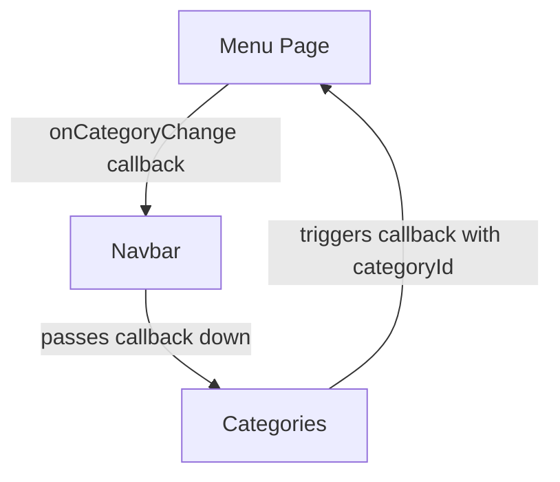

## Overview

The Navbar component serves as the main navigation header for the Q-Sopa application. It displays the restaurant logo and integrates the Categories component for menu navigation.

## Location

```
src/components/navbar/Navbar.jsx
src/components/navbar/Navbar.css
```

## Props

<ParamField path="onCategoryChange" type="function" required>
  Callback function triggered when a category is selected. Receives the category ID as a parameter.
  
  ```jsx
  (categoryId: number) => void
  ```
</ParamField>

<Note>
  Although the code shows `onLogoClick` being passed to Navbar in Menu.jsx, it's not currently used in the Navbar component implementation. The logo link is a simple `<a href="#">` tag.
</Note>

## Source Code

```jsx src/components/navbar/Navbar.jsx
import "./Navbar.css";
import logo from "../../assets/logo_Q-spoa.jpg";
import Categories from "../Categories/Categories";

export default function Navbar({ onCategoryChange }) {
  return (
    <header className="navbar-wrapper">
      <div className="navbar">

        {/* Logo */}
        <div className="navbar-left">
          <a href="#">
          
        </a>
        </div>

        {/* Categorías — recibe el callback y lo pasa hacia abajo */}
        <div className="navbar-center">
          <Categories onCategoryChange={onCategoryChange} />
        </div>

      </div>
    </header>
  );
}
```

## Usage Example

The Navbar is typically used at the page level with state management for category changes:

```jsx src/pages/Menu.jsx
import { useState } from "react";
import Navbar from "../components/navbar/Navbar";

export default function Menu() {
  const [activeCategoryId, setActiveCategoryId] = useState(null);
  
  const handleCategoryChange = (categoryId) => {
    setActiveCategoryId(categoryId);
  };
  
  return (
    <>
      <Navbar onCategoryChange={handleCategoryChange} />
      {/* Rest of the page content */}
    </>
  );
}
```

## Structure

The Navbar has a simple three-part layout:

### 1. Wrapper (`navbar-wrapper`)
The outer `<header>` element that provides the full-width container.

### 2. Logo Section (`navbar-left`)
Contains the Q-Sopa logo image wrapped in an anchor tag. The logo is imported from `src/assets/logo_Q-spoa.jpg`.

### 3. Categories Section (`navbar-center`)
Embeds the Categories component and passes down the `onCategoryChange` callback for category selection handling.

## Styling Details

The Navbar uses CSS classes for layout:

- `.navbar-wrapper` - Main header container with fixed positioning
- `.navbar` - Flex container for layout
- `.navbar-left` - Left-aligned logo section
- `.navbar-center` - Center-aligned categories section
- `.navbar-logo` - Styles for the logo image

<Warning>
  The Navbar uses a fixed or sticky position (defined in Navbar.css), which means it remains visible at the top of the viewport when scrolling.
</Warning>

## Component Relationships



The Navbar acts as a pass-through component, receiving the `onCategoryChange` callback from the parent Menu page and forwarding it to the Categories component.

## Assets

The component imports and displays the restaurant logo:

```jsx
import logo from "../../assets/logo_Q-spoa.jpg";
```

The logo is displayed with alt text "Burger Bistro Logo" for accessibility.

## Best Practices

<CardGroup cols={2}>
  <Card title="Callback Pattern" icon="arrow-up-right-from-square">
    Always provide the `onCategoryChange` callback to enable category navigation functionality.
  </Card>
  
  <Card title="Fixed Positioning" icon="thumbtack">
    The navbar remains visible during scroll, providing constant access to navigation.
  </Card>
</CardGroup>